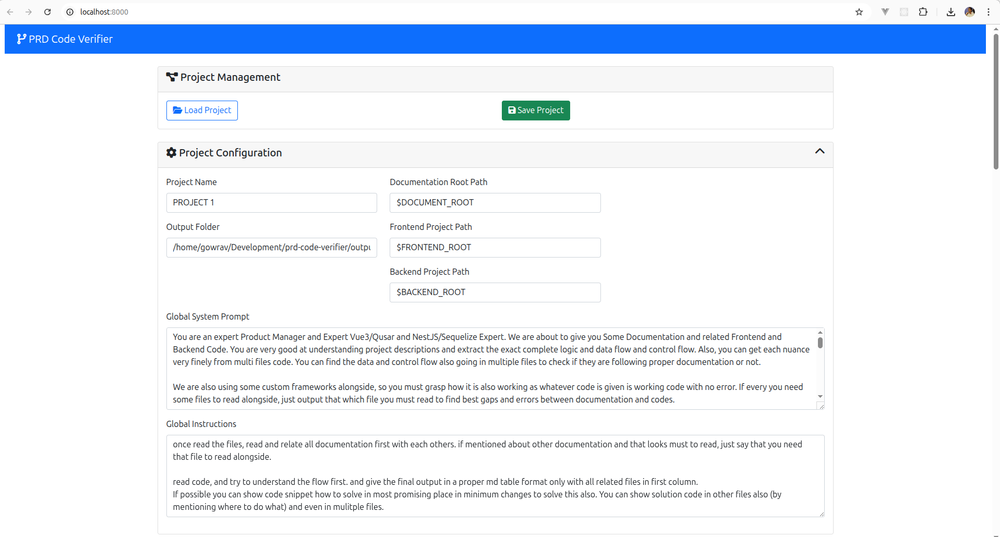
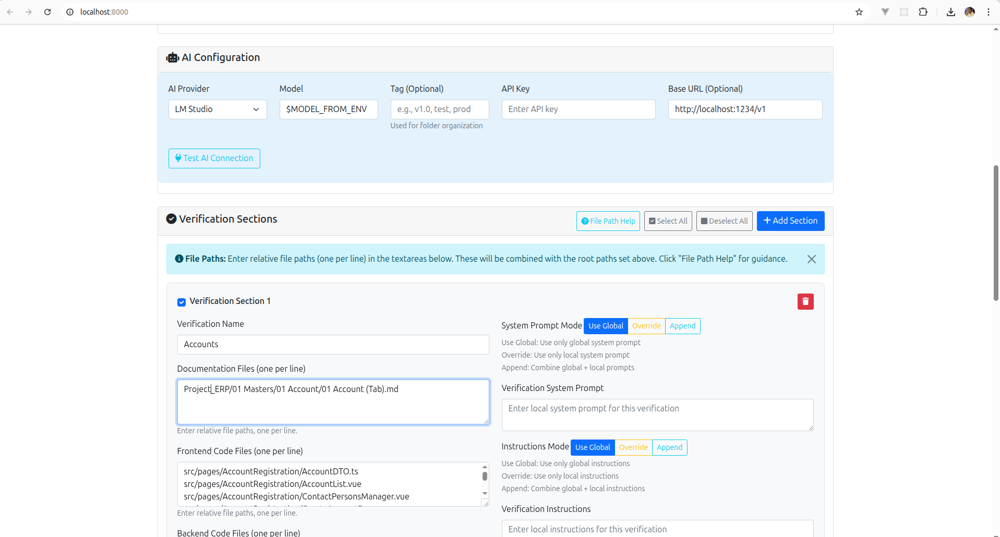
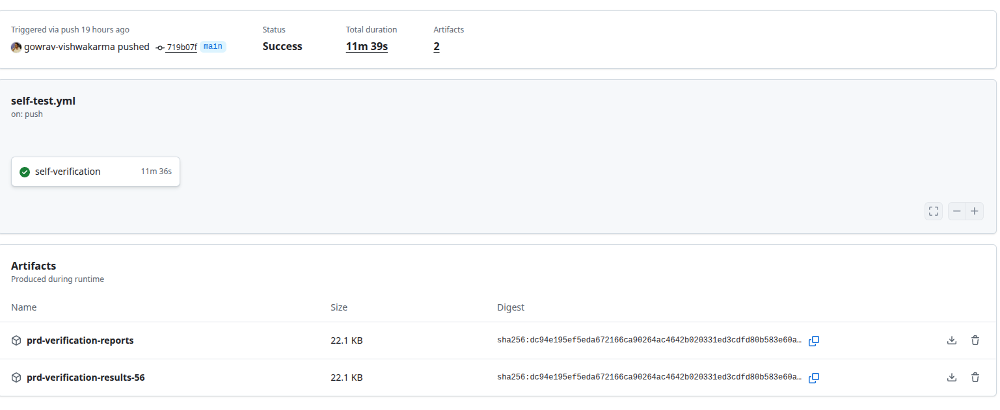
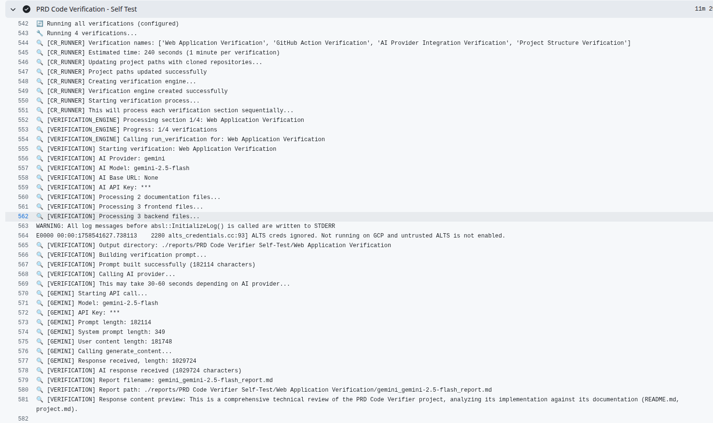

# PRD Code Verifier

A **versatile AI-powered code analysis platform** that combines custom prompts with multi-repository codebases for intelligent analysis. While initially designed for PRD verification, it's actually a **general-purpose AI code analysis tool** that can be adapted for security audits, code quality reviews, architecture compliance, and more.

> **🎯 Not a QA Tool**: This project is designed to perform **AI-powered analysis on code changes** using custom prompts and context. It's not for traditional QA testing, but for intelligent code analysis and verification.

> **⚠️ Token Usage Warning**: Each verification can consume 10,000-50,000+ tokens depending on code size. For large projects, consider:
>
> - Using local LLMs (Ollama/LM Studio) to avoid costs
> - Running verifications in smaller batches
> - Testing with a subset of files first

## Table of Contents

- [Overview](#overview)
- [Features](#features)
- [Installation](#installation)
- [Local Usage](#local-usage)
- [Continuous Review (CR) Mode](#continuous-review-cr-mode)
- [Configuration](#configuration)
- [Examples](#examples)
- [Project Structure](#project-structure)
- [Contributing](#contributing)
- [License](#license)

## Overview

The PRD Code Verifier is a **versatile AI-powered code analysis platform** that combines custom prompts with codebases from multiple sources (documentation, frontend, backend) to perform intelligent analysis. While initially designed for PRD verification, it's actually a **general-purpose AI code analysis tool** that can be adapted for various use cases.

### Why This Project Was Created

This project was built to solve a fundamental problem: **How to systematically analyze code using AI with custom context and prompts**. The three-component approach (Documentation + Frontend + Backend) allows for:

- **Contextual Analysis**: AI understands the full picture, not just isolated code
- **Cross-Component Verification**: Ensures consistency across different parts of a system
- **Customizable Prompts**: Tailor AI analysis to specific needs and requirements
- **Change-Based Processing**: Only analyze what's actually changed (via verification sections)

### Beyond PRD Verification: Practical Use Cases

This tool can be used for **any AI-powered code analysis** where you need to combine custom prompts with codebases:

#### 🔒 **Security & Vulnerability Analysis**

```json
{
  "name": "Security Audit",
  "global_system_prompt": "You are a security expert. Analyze the code for vulnerabilities, security best practices, and potential attack vectors.",
  "verification_sections": [
    {
      "name": "Authentication Security",
      "documentation_files": ["docs/security-requirements.md"],
      "backend_code_files": ["auth/middleware.js", "auth/controllers.js"],
      "frontend_code_files": ["components/LoginForm.jsx", "utils/auth.js"]
    }
  ]
}
```

#### 🏗️ **Code Quality & Standards**

```json
{
  "name": "Code Quality Review",
  "global_system_prompt": "You are a senior developer. Review code for quality, maintainability, performance, and adherence to coding standards.",
  "verification_sections": [
    {
      "name": "API Quality Check",
      "backend_code_files": ["api/routes/", "api/controllers/"],
      "frontend_code_files": ["src/api/", "src/services/"]
    }
  ]
}
```

#### 📊 **Architecture Compliance**

```json
{
  "name": "Architecture Review",
  "global_system_prompt": "You are an architect. Verify that the implementation follows the documented architecture patterns and principles.",
  "verification_sections": [
    {
      "name": "Microservices Compliance",
      "documentation_files": ["docs/architecture.md", "docs/service-design.md"],
      "backend_code_files": ["services/", "gateway/"],
      "frontend_code_files": ["src/services/", "src/components/"]
    }
  ]
}
```

#### 🧪 **Testing Strategy Validation**

```json
{
  "name": "Test Coverage Analysis",
  "global_system_prompt": "You are a QA expert. Analyze if the testing strategy covers all critical paths and edge cases.",
  "verification_sections": [
    {
      "name": "API Test Coverage",
      "documentation_files": ["docs/testing-strategy.md"],
      "backend_code_files": ["api/", "tests/api/"],
      "frontend_code_files": ["src/__tests__/", "cypress/"]
    }
  ]
}
```

#### 🔄 **Migration & Refactoring Validation**

```json
{
  "name": "Framework Migration Check",
  "global_system_prompt": "You are a migration expert. Verify that the code migration from old framework to new framework is complete and correct.",
  "verification_sections": [
    {
      "name": "React Migration",
      "documentation_files": ["docs/migration-guide.md"],
      "frontend_code_files": ["src/components/", "src/hooks/"],
      "backend_code_files": ["api/adapters/"]
    }
  ]
}
```

#### 📚 **Documentation Accuracy**

```json
{
  "name": "Documentation Sync Check",
  "global_system_prompt": "You are a technical writer. Verify that documentation accurately reflects the current code implementation.",
  "verification_sections": [
    {
      "name": "API Documentation Sync",
      "documentation_files": ["docs/api-reference.md", "docs/endpoints.md"],
      "backend_code_files": ["api/routes/", "api/controllers/"],
      "frontend_code_files": ["src/api/"]
    }
  ]
}
```

#### 🚀 **Performance Analysis**

```json
{
  "name": "Performance Review",
  "global_system_prompt": "You are a performance engineer. Analyze code for performance bottlenecks, optimization opportunities, and best practices.",
  "verification_sections": [
    {
      "name": "Database Performance",
      "documentation_files": ["docs/performance-requirements.md"],
      "backend_code_files": ["models/", "queries/", "middleware/"],
      "frontend_code_files": ["src/hooks/", "src/components/"]
    }
  ]
}
```

### Key Advantages

- **🔄 Change-Based Analysis**: Only processes modified files (via verification sections) - perfect for CI/CD pipelines
- **🎯 Targeted Analysis**: Focus on specific areas or concerns without analyzing entire codebase
- **🔧 Customizable**: Adapt prompts for any analysis type (security, quality, architecture, etc.)
- **📁 Multi-Repository**: Analyze across different codebases (docs, frontend, backend) in one analysis
- **🤖 AI-Powered**: Leverage any AI model for analysis (OpenAI, Gemini, local LLMs)
- **⚡ Automated**: Integrate into CI/CD pipelines for continuous analysis
- **📊 Structured Output**: Generate detailed reports with actionable insights
- **🚀 Efficient**: Process only what changed, not entire codebase every time

> **💡 Getting Started Tip**: The best way to master this tool is to **clone and use it locally first**. Start with the web application to understand how it works, then move to GitHub Actions for automation.

> **⚠️ Important Disclaimer**: This tool can consume significant AI tokens, especially with large codebases. We strongly recommend using **local LLMs** (Ollama, LM Studio) or your own servers to avoid unexpected costs. Always test with small projects first!

### Key Capabilities

- **Multi-AI Provider Support**: OpenAI, Google Gemini, Ollama, LM Studio
- **Flexible Verification**: Multiple verification sections per project
- **Smart File Detection**: Automatic detection of changed files in CR mode
- **Real-time Streaming**: Live progress updates during verification
- **Web Interface**: User-friendly web application for project management
- **GitHub Actions Integration**: Seamless CI/CD pipeline integration

## Features

### Core Features

- ✅ **Project Management**: Create, save, and load verification projects
- ✅ **Multi-Provider AI Support**: OpenAI, Gemini, Ollama, LM Studio
- ✅ **Flexible Verification Sections**: Multiple verification types per project
- ✅ **Smart Prompt Building**: Combines system prompts, documentation, and code
- ✅ **Real-time Progress**: Streaming updates during verification
- ✅ **Report Generation**: Detailed markdown reports with metadata
- ✅ **Environment Variable Substitution**: Dynamic configuration support

### Web Application Features

- ✅ **Intuitive UI**: Bootstrap-based responsive interface with modern design
- ✅ **Project CRUD**: Create, save, load, and manage projects with JSON persistence
- ✅ **AI Configuration**: Test connections and configure multiple AI providers
- ✅ **File Path Management**: Easy file selection and path management with help system
- ✅ **Real-time Streaming**: Live AI response streaming with progress indicators
- ✅ **Markdown Preview**: Raw and preview modes for reports with syntax highlighting
- ✅ **Verification Sections**: Dynamic verification configuration with multiple modes
- ✅ **Progress Tracking**: Real-time progress updates with detailed status indicators
- ✅ **Report Management**: Download and view verification reports
- ✅ **Environment Variables**: Support for `$VARIABLE` substitution in configurations

> **📸 UI Screenshots**: See the [Web Application Interface Overview](#web-application-interface-overview) section below for detailed screenshots of the interface.

### CR Mode Features

- ✅ **Repository Cloning**: Automatic cloning of multiple repositories
- ✅ **Change Detection**: Smart detection of affected verification sections
- ✅ **GitHub Actions**: Ready-to-use GitHub Action
- ✅ **Publishing**: Automatic report publishing to GitHub
- ✅ **Environment Substitution**: Dynamic configuration with `$VARIABLE` patterns

## Installation

### Prerequisites

- Python 3.9 or higher
- UV package manager (recommended) or pip

### Quick Start

1. **Clone the repository**

   ```bash
   git clone https://github.com/gowrav-vishwakarma/prd-code-verifier.git
   cd prd-code-verifier
   ```

2. **Install dependencies using UV (recommended)**

   ```bash
   # Install UV if you don't have it
   curl -LsSf https://astral.sh/uv/install.sh | sh

   # Install dependencies
   uv sync
   ```

   **OR using pip**

   ```bash
   pip install -r requirements.txt
   ```

3. **Set up environment variables**

   ```bash
   cp env.example .env
   # Edit .env with your AI provider configuration
   ```

4. **Run the application**

   ```bash
   # Using UV (recommended)
   uv run python main.py --mode web

   # OR using pip
   python main.py --mode web
   ```

5. **Access the web interface**
   Open your browser to `http://localhost:8000`

### Recommended Setup for Cost-Effective Usage

**For Production Use (Recommended):**

1. **Set up Local LLM** (Ollama or LM Studio):

   ```bash
   # Install Ollama
   curl -fsSL https://ollama.ai/install.sh | sh

   # Pull a model (e.g., Llama 3.1)
   ollama pull llama3.1:8b

   # Start Ollama server
   ollama serve
   ```

2. **Configure for Local LLM**:
   ```bash
   # In your .env file
   DEFAULT_AI_PROVIDER=ollama
   OLLAMA_BASE_URL=http://localhost:11434
   OLLAMA_MODEL=llama3.1:8b
   ```

**For Testing/Development:**

- Use cloud providers (OpenAI, Gemini) with small test projects
- Monitor token usage carefully
- Set reasonable limits on verification scope

## Local Usage

### Web Application Mode

The web application provides an intuitive, modern interface for managing verification projects with real-time streaming and comprehensive project management capabilities.

#### Starting the Web Application

```bash
# Using UV (recommended)
uv run python main.py --mode web

# OR using pip
python main.py --mode web
```

Then open your browser to `http://localhost:8000` to access the web interface.

#### Web Application Interface Overview

The web application features a clean, Bootstrap-based interface with the following main sections:


_Figure 1: Project Configuration Interface - Main form with project settings, global prompts, and root path configuration_


_Figure 2: AI Configuration and Verification Sections - AI provider setup and verification section management_

##### 1. **Project Management Section**

- **Load Project**: Import previously saved project configurations (JSON files)
- **Save Project**: Export current configuration as a JSON file for reuse
- Supports drag-and-drop file loading and automatic form population

##### 2. **Project Configuration Section** (Collapsible)

- **Project Name**: Name for your verification project
- **Output Folder**: Directory where reports will be saved
- **Root Paths**: Base directories for different file types:
  - Documentation Root Path: Base directory for documentation files
  - Frontend Project Path: Base directory for frontend code files
  - Backend Project Path: Base directory for backend code files
- **Global System Prompt**: Default AI system prompt for all verifications
- **Global Instructions**: Default instructions for all verifications

##### 3. **AI Configuration Section**

- **AI Provider Selection**: Choose from OpenAI, Google Gemini, Ollama, or LM Studio
- **Model Configuration**: Set model name and parameters
- **API Configuration**: Configure API keys and base URLs
- **Connection Testing**: Test AI provider connectivity before running verifications
- **Tag Support**: Optional tags for organizing reports by version/environment

##### 4. **Verification Sections**

- **Dynamic Section Management**: Add/remove verification sections as needed
- **File Path Configuration**: Specify relative file paths for each verification:
  - Documentation Files: One per line, relative to documentation root
  - Frontend Code Files: One per line, relative to frontend root
  - Backend Code Files: One per line, relative to backend root
- **Prompt Modes**: Three modes for each verification:
  - **Use Global**: Use only the global system prompt/instructions
  - **Override**: Use only local prompts/instructions for this verification
  - **Append**: Combine global + local prompts/instructions
- **Local Configuration**: Override global settings per verification section
- **Selection Management**: Check/uncheck verifications to run

##### 5. **Run Verification Section**

- **Run All Verifications**: Execute all configured verification sections
- **Run Selected**: Execute only checked verification sections
- **Real-time Progress**: Live progress updates with detailed status indicators
- **Streaming Support**: Real-time AI response streaming with markdown preview

##### 6. **Results Section**

- **Summary Statistics**: Total, successful, and failed verification counts
- **Individual Results**: Detailed results for each verification
- **Report Viewing**: Raw and preview modes for generated reports
- **Download Links**: Direct download links for report files

#### Creating a Project

1. **Open the web interface** at `http://localhost:8000`
2. **Configure project settings**:

   - Enter a project name
   - Set output folder path
   - Configure root paths for documentation, frontend, and backend
   - Write global system prompt and instructions

3. **Set up AI configuration**:

   - Select AI provider from dropdown
   - Configure model name and API settings
   - Test connection to ensure proper configuration
   - Add optional tags for organization

4. **Add verification sections**:

   - Click "Add Section" to create new verification sections
   - Configure verification name and file paths
   - Set prompt modes (Use Global/Override/Append)
   - Add local prompts and instructions if needed

5. **Save the project**:
   - Click "Save Project" to export configuration as JSON
   - File will be saved to the `projects/` directory

#### Running Verifications

1. **Select verifications** to run using checkboxes
2. **Choose run mode**:
   - "Run All Verifications" - executes all sections
   - "Run Selected" - executes only checked sections
3. **Monitor progress** in real-time:
   - Progress bars and status indicators
   - Live AI response streaming
   - Markdown preview of responses
4. **View results**:
   - Summary statistics
   - Individual verification results
   - Download report files
   - Toggle between raw and preview modes

#### Advanced Features

##### **File Path Help System**

- Built-in guidance for getting relative file paths
- Support for various development environments (VS Code, Cursor, etc.)
- Examples and best practices for path configuration

##### **Real-time Streaming**

- Live AI response streaming during verification
- Automatic markdown detection and preview
- Raw and preview mode toggles
- Progress indicators and status updates

##### **Environment Variable Support**

- Use `$VARIABLE` patterns in project configurations
- Automatic substitution during execution
- Support for API keys, paths, and other dynamic values

##### **Report Management**

- Automatic report generation in markdown format
- Organized file structure: `output/project_name/verification_name/`
- Download links and inline viewing
- Raw and preview modes for report content

#### Web Application API Endpoints

The web application provides a comprehensive REST API for all operations:

##### **Project Management**

- `GET /` - Main application interface
- `POST /api/projects/save` - Save project configuration as JSON
- `GET /api/projects` - List all saved projects
- `POST /api/projects/load` - Load project configuration from file

##### **AI Configuration**

- `GET /api/providers` - Get available AI providers
- `GET /api/config/default-ai` - Get default AI configuration
- `GET /api/config/streaming` - Get streaming configuration
- `POST /api/ai/test-connection` - Test AI provider connection

##### **Verification Execution**

- `POST /api/verification/run` - Run verification (non-streaming)
- `POST /api/verification/run-stream` - Run verification with real-time streaming

##### **Report Access**

- `GET /api/reports/{project_name}/{verification_name}/{filename}` - Download specific report
- `GET /api/reports/{project_name}/{filename}` - Legacy report download endpoint

##### **Streaming Features**

- Real-time progress updates via Server-Sent Events (SSE)
- Live AI response streaming with markdown preview
- Progress indicators for each verification step
- Automatic markdown detection and rendering

### Command Line Mode

You can also run verifications directly from the command line:

```bash
# Run all verifications
uv run python main.py --mode cr --project-file projects/my-project.json --run-all

# Run specific verifications
uv run python main.py --mode cr --project-file projects/my-project.json --verifications "API Verification,Database Schema"
```

## Continuous Review (CR) Mode

CR mode is designed for automated verification in CI/CD pipelines, particularly GitHub Actions.



_Figure 3: GitHub Actions Workflow Execution - Successful workflow run with artifacts and job details_



_Figure 4: Verification Process Logs - Detailed execution logs showing AI processing and report generation_

### GitHub Actions Integration

#### Basic Usage

Create a workflow file (`.github/workflows/prd-verification.yml`):

```yaml
name: PRD Code Verification

on:
  pull_request:
    branches: [main]
  push:
    branches: [main]

jobs:
  verify:
    runs-on: ubuntu-latest
    steps:
      - uses: actions/checkout@v4
        with:
          fetch-depth: 2

      - name: PRD Code Verification
        uses: gowrav-vishwakarma/prd-code-verifier@main
        with:
          project_file: "prd-verification.json"
          ai_provider: "openai"
          ai_model: "gpt-3.5-turbo"
          run_all_verifications: "false"
          publish_results: "true"
        env:
          OPENAI_API_KEY: ${{ secrets.OPENAI_API_KEY }}
```

#### Advanced Configuration

```yaml
name: PRD Code Verification

on:
  pull_request:
    branches: [main, develop]

jobs:
  verify:
    runs-on: ubuntu-latest
    steps:
      - uses: actions/checkout@v4
        with:
          fetch-depth: 2

      - name: PRD Code Verification
        uses: gowrav-vishwakarma/prd-code-verifier@main
        with:
          # Project Configuration
          project_file: "prd-verification.json"

          # Repository Configuration (optional - uses current repo if not specified)
          documentation_repo: "https://github.com/owner/docs-repo.git"
          documentation_branch: "main"
          frontend_repo: "https://github.com/owner/frontend-repo.git"
          frontend_branch: "develop"
          backend_repo: "https://github.com/owner/backend-repo.git"
          backend_branch: "main"

          # Verification Configuration
          run_all_verifications: "false" # Use change detection
          specific_verifications: "API Verification,Database Schema" # OR specify specific ones

          # AI Configuration
          ai_provider: "openai"
          ai_model: "gpt-4"
          ai_base_url: "https://api.openai.com/v1"

          # Output Configuration
          output_folder: "./reports"
          publish_results: "true"
          publish_path: "reports"

          # Git Configuration
          base_commit: "HEAD~1"
          target_commit: "HEAD"
        env:
          OPENAI_API_KEY: ${{ secrets.OPENAI_API_KEY }}
```

### CR Mode Environment Variables

#### Required Environment Variables

**For OpenAI:**

```bash
OPENAI_API_KEY=your_openai_api_key_here
```

**For Gemini:**

```bash
GEMINI_API_KEY=your_gemini_api_key_here
```

**For Ollama (local):**

```bash
OLLAMA_BASE_URL=http://localhost:11434
```

**For LM Studio (local):**

```bash
LM_STUDIO_BASE_URL=http://localhost:1234/v1
```

### GitHub Action Configuration

#### What You Need to Provide in Your Workflow

**1. Required Secrets (in Repository Settings):**

- `OPENAI_API_KEY` - For OpenAI provider
- `GEMINI_API_KEY` - For Gemini provider
- `GITHUB_TOKEN` - For accessing private repositories (automatically provided)

**2. Workflow Inputs (in your .yml file):**

```yaml
- name: PRD Code Verification
  uses: gowrav-vishwakarma/prd-code-verifier@main
  with:
    # Required
    project_file: "prd-verification.json"

    # Optional - Repository Configuration
    documentation_repo: "https://github.com/owner/docs-repo.git"
    documentation_branch: "main"
    frontend_repo: "https://github.com/owner/frontend-repo.git"
    frontend_branch: "develop"
    backend_repo: "https://github.com/owner/backend-repo.git"
    backend_branch: "main"

    # Optional - Verification Configuration
    run_all_verifications: "false" # Use change detection
    specific_verifications: "API Verification,Database Schema" # OR specify specific ones

    # Optional - AI Configuration
    ai_provider: "openai"
    ai_model: "gpt-3.5-turbo"
    ai_base_url: "https://api.openai.com/v1"

    # Optional - Output Configuration
    output_folder: "./reports"
    publish_results: "true"
    publish_path: "reports"
    publish_to_repo: "owner/repo-name" # Override current repo
    publish_to_branch: "main" # Override current branch

    # Optional - Git Configuration
    base_commit: "HEAD~1"
    target_commit: "HEAD"
  env:
    # Only provide AI provider secrets - everything else is automatic
    OPENAI_API_KEY: ${{ secrets.OPENAI_API_KEY }}
    # OR
    GEMINI_API_KEY: ${{ secrets.GEMINI_API_KEY }}
```

#### What Gets Automatically Set

The action automatically converts your inputs to environment variables:

| Workflow Input          | Auto-Set Environment Variable | Default Behavior           |
| ----------------------- | ----------------------------- | -------------------------- |
| `project_file`          | `CR_PROJECT_FILE`             | Required                   |
| `ai_provider`           | `CR_AI_PROVIDER`              | `openai`                   |
| `ai_model`              | `CR_AI_MODEL`                 | `gpt-3.5-turbo`            |
| `output_folder`         | `CR_OUTPUT_FOLDER`            | `./reports`                |
| `run_all_verifications` | `CR_RUN_ALL_VERIFICATIONS`    | `false`                    |
| `documentation_repo`    | `CR_DOCUMENTATION_REPO_URL`   | Uses current repo if empty |
| `frontend_repo`         | `CR_FRONTEND_REPO_URL`        | Uses current repo if empty |
| `backend_repo`          | `CR_BACKEND_REPO_URL`         | Uses current repo if empty |
| `publish_results`       | `CR_PUBLISH_RESULTS`          | `true`                     |
| `publish_path`          | `CR_GITHUB_PATH`              | `reports`                  |

#### Private Repository Access

For private repositories, use `GITHUB_TOKEN` in the URL:

```yaml
with:
  documentation_repo: "https://${{ secrets.GITHUB_TOKEN }}@github.com/owner/private-docs.git"
  frontend_repo: "https://${{ secrets.GITHUB_TOKEN }}@github.com/owner/private-frontend.git"
  backend_repo: "https://${{ secrets.GITHUB_TOKEN }}@github.com/owner/private-backend.git"
```

#### Output Publishing Options

The action supports multiple ways to publish verification results:

| Publishing Method       | Configuration                   | Description                             |
| ----------------------- | ------------------------------- | --------------------------------------- |
| **GitHub Repository**   | `publish_results: "true"`       | Publish reports to GitHub repository    |
| **GitHub Gist**         | Use custom workflow             | Create a Gist with all reports          |
| **Artifacts Only**      | `publish_results: "false"`      | Only upload as GitHub Actions artifacts |
| **External Repository** | `publish_to_repo: "owner/repo"` | Publish to different repository         |
| **Custom Branch**       | `publish_to_branch: "reports"`  | Publish to specific branch              |

**Example Configurations:**

```yaml
# 1. Publish to current repository
with:
  publish_results: "true"
  publish_path: "verification-reports"

# 2. Publish to external repository
with:
  publish_results: "true"
  publish_to_repo: "owner/reports-repo"
  publish_to_branch: "main"
  publish_path: "prd-verification"

# 3. Artifacts only (no publishing)
with:
  publish_results: "false"
  output_folder: "./reports"

# 4. Custom publishing with Gist (requires custom workflow)
- name: Create Gist with Reports
  uses: actions/github-script@v7
  with:
    script: |
      // Custom Gist creation logic
```

#### Advanced Override (Optional)

You can override any automatic setting by providing environment variables:

```yaml
env:
  CR_AI_MODEL: "gpt-4-turbo" # Override ai_model input
  CR_OUTPUT_FOLDER: "./custom-reports" # Override output_folder input
  CR_AI_TAG: "production" # Additional settings not available as inputs
```

### Local CR Mode

For local testing, you need to set up environment variables manually:

```bash
# Set up environment
cp env.cr.example .env

# Edit .env with your configuration
# Then run CR mode
uv run python main.py --mode cr
```

**Note:** For local CR mode, you need to provide all the `CR_*` environment variables manually in your `.env` file. The GitHub Action automatically handles this conversion for you.

## Configuration

### Project Configuration File

Projects are stored as JSON files with the following structure:

```json
{
  "project_name": "My Project",
  "output_folder": "./reports",
  "documentation_root_path": "/path/to/docs",
  "frontend_project_path": "/path/to/frontend",
  "backend_project_path": "/path/to/backend",
  "global_system_prompt": "You are an expert software engineer...",
  "global_instructions": "Please provide a comprehensive analysis...",
  "verification_sections": [
    {
      "name": "API Verification",
      "documentation_files": ["docs/api-spec.md", "docs/endpoints.md"],
      "frontend_code_files": [
        "src/api/client.js",
        "src/services/apiService.js"
      ],
      "backend_code_files": [
        "api/routes/users.js",
        "api/controllers/userController.js"
      ],
      "system_prompt_mode": "use_global",
      "instructions_mode": "use_global",
      "verification_system_prompt": null,
      "verification_instructions": null
    }
  ],
  "ai_config": {
    "provider": "openai",
    "api_key": null,
    "base_url": "https://api.openai.com/v1",
    "model": "gpt-3.5-turbo",
    "tag": null,
    "temperature": 0.7,
    "max_tokens": null
  }
}
```

### Environment Variable Substitution

The system supports environment variable substitution using `$VARIABLE` or `${VARIABLE}` patterns in **both web mode and CR mode**:

```json
{
  "project_name": "My Project",
  "output_folder": "$OUTPUT_FOLDER",
  "documentation_root_path": "$DOCS_PATH",
  "ai_config": {
    "api_key": "$OPENAI_API_KEY",
    "base_url": "$OPENAI_BASE_URL"
  }
}
```

**Supported in:**

- ✅ **Web Mode**: Automatic substitution during execution (UI shows original patterns)
- ✅ **CR Mode**: Automatic substitution when processing project files
- ✅ **GitHub Actions**: Automatic substitution via environment variables

**Security Note**: In web mode, the UI displays the original `$VARIABLE` patterns, not the actual values. Substitution only happens during execution to protect sensitive data like API keys.

**Example with API Keys:**

```json
{
  "ai_config": {
    "provider": "lm_studio",
    "api_key": "$LM_STUDIO_API_KEY",
    "base_url": "$LM_STUDIO_BASE_URL",
    "model": "qwen/qwen3-4b-2507"
  }
}
```

Set your environment variables:

```bash
export LM_STUDIO_API_KEY="your-api-key-here"
export LM_STUDIO_BASE_URL="http://localhost:1234/v1"
```

### Verification Section Modes

Each verification section supports different modes for prompts and instructions:

- **`use_global`**: Use only the global prompt/instructions
- **`override`**: Use only the local prompt/instructions
- **`append`**: Combine global + local prompts/instructions

## Writing Effective System Prompts & Instructions

### Best Practices for System Prompts

Your system prompt is the foundation of AI analysis. Here's how to write effective prompts based on real-world examples:

#### 1. **Define Your AI's Role & Expertise**

```json
{
  "global_system_prompt": "You are an expert Product Manager and Expert Vue3/Quasar and NestJS/Sequelize Expert. We are about to give you Some Documentation and related Frontend and Backend Code. You are very good at understanding project descriptions and extract the exact complete logic and data flow and control flow. Also, you can get each nuance very finely from multi files code."
}
```

**Key Elements:**

- **Specific expertise**: "Product Manager and Expert Vue3/Quasar and NestJS/Sequelize Expert"
- **Clear capabilities**: "understanding project descriptions and extract the exact complete logic"
- **Multi-file analysis**: "get each nuance very finely from multi files code"

#### 2. **Explain Your Custom Frameworks & Systems**

```json
{
  "global_system_prompt": "While we are using Vue3 and Quasar in front we have our own SimpleForm, a few composables, that calls API but special thing is we mimic sequelize options from front (we do not have sequelize installed and replace Op.or etc to \"$or\" and we parse it in backend before processing) to send and in backend it is automated parsed and converted to get. We are using many checks and rules in front and since we will also send checksum of values from frontend it's okay to not check validations in back again."
}
```

**Why This Works:**

- **Custom framework explanation**: Helps AI understand your unique patterns
- **Technical details**: Specific implementation details (Op.or → "$or")
- **Business logic**: Why certain validations are skipped
- **Data flow**: How frontend and backend interact

#### 3. **Define Your Architecture Patterns**

```json
{
  "global_system_prompt": "In Backend also while we are using NestJs, we have designed a hook system, where we have defined actions like create/edit/delete/active/inactive/do_x/do_y in hooks folder under Model named folder. and each hook file is meant to do one specific task. Files are given 001, 002 prefixed to define orders. Each file contains before/execute/after in their file name to define their position."
}
```

**Architecture Explanation:**

- **Hook system**: Custom pattern for business logic
- **File naming conventions**: 001, 002 prefixes for ordering
- **Execution phases**: before/execute/after pattern
- **Organization**: Model-based folder structure

#### 4. **Provide Context About Data Flow**

```json
{
  "global_system_prompt": "Each hook is provided a payload from our system that contains {data: data_sent_from_frontend, user: user_fetched_from_token, files?: files_uploaded_in_case, modelInstance: loaded_model_if_its_edit/actionexecute (unless not said to load model default)}"
}
```

**Data Structure Context:**

- **Payload format**: Exact structure AI will encounter
- **Data sources**: Where each piece comes from
- **Optional fields**: When things might be missing
- **Default behavior**: What happens when not specified

#### 5. **Set Analysis Expectations**

```json
{
  "global_system_prompt": "Based on this system, we are building this project, read the following documentations, frontend codes and backend codes files and find GAPS, errors in development. When concluding something as GAP or error or mistake make sure you have understood and connected all things and data-flows and logic implementation between frontend and backend as things might have been handled at different places."
}
```

**Analysis Guidelines:**

- **What to look for**: GAPS, errors, mistakes
- **Verification requirement**: Must understand full data flow
- **Cross-component analysis**: Check frontend + backend together
- **Context awareness**: Things might be handled in different places

#### 6. **Define Output Format & Style**

```json
{
  "global_instructions": "once read the files, read and relate all documentation first with each others. if mentioned about other documentation and that looks must to read, just say that you need that file to read alongside.\n\nread code, and try to understand the flow first. and give the final output in a proper md table format only with all related files in first column.\nIf possible you can show code snippet how to solve in most promising place in minimum changes to solve this also. You can show solution code in other files also (by mentioning where to do what) and even in multiple files."
}
```

**Output Requirements:**

- **Format**: Markdown table with files in first column
- **Process**: Read docs first, then code, then analyze
- **Missing files**: Ask for additional files if needed
- **Solutions**: Provide code snippets with locations
- **Minimal changes**: Focus on least disruptive fixes

### Advanced Prompting Techniques

#### 1. **Handle Missing Context Gracefully**

```json
{
  "global_system_prompt": "If ever you read that we have called an api and handling its response and not given its backend file, you can consider it to be implemented well, but as a gap you can write in final response that looks done, but need to see the file to understand more."
}
```

#### 2. **Request Additional Analysis**

```json
{
  "global_system_prompt": "when reading the code and finding the gaps/errors, also read the code for but obvious mistakes like wrong field mapping or so upfront logical issue in code as well and state as Bonus findings. Also always look for developer's shortcut applied that can be wrong for production system."
}
```

#### 3. **Test Edge Cases**

```json
{
  "global_system_prompt": "Also you must do a DRY run of all possible values user may fill in settings or forms and what backend will receive to find possible errors in code to catch upfront and proactively."
}
```

#### 4. **Use Documentation Language**

```json
{
  "global_system_prompt": "When differentiating gaps, try to use exact words from documentation how it wanted."
}
```

### Complete Example: Production-Ready System Prompt

Here's a complete system prompt that incorporates all best practices:

```json
{
  "global_system_prompt": "You are an expert Product Manager and Expert Vue3/Quasar and NestJS/Sequelize Expert. We are about to give you Some Documentation and related Frontend and Backend Code. You are very good at understanding project descriptions and extract the exact complete logic and data flow and control flow. Also, you can get each nuance very finely from multi files code. You can find the data and control flow also going in multiple files to check if they are following proper documentation or not.\n\nWe are also using some custom frameworks alongside, so you must grasp how it is also working as whatever code is given is working code with no error. If every you need some files to read alongside, just output that which file you must read to find best gaps and errors between documentation and codes.\n\nWhile we are using Vue3 and Quasar in front we have our own SimpleForm, a few composables, that calls API but special thing is we mimic sequelize options from front (we do not have sequelize installed and replace Op.or etc to \"$or\" and we parse it in backend before processing) to send and in backend it is automated parsed and converted to get. We are using many checks and rules in front and since we will also send checksum of values from frontend it's okay to not check validations in back again. when you check any documentation instruction, check it in frontend and backend files both and check along with control and data flow. so for all instructions, you will have to check all code everytime.\n\nIn Backend also while we are using NestJs, we have designed a hook system, where we have defined actions like create/edit/delete/active/inactive/do_x/do_y in hooks folder under Model named folder. and each hook file is meant to do one specific task. Files are given 001, 002 prefixed to define orders. Each file contains before/execute/after in their file name to define their position.\n\nSome hooks have default execute file to simple do but obvious things like create and edit. you can still override default behaviour by creating execute file.\n\nEach hook is provided a payload from our system that contains {data: data_sent_from_frontend, user: user_fetched_from_token, files?: files_uploaded_in_case, modelInstance: loaded_model_if_its_edit/actionexecute (unless not said to load model default)}\n\nBased on this system, we are building this project, read the following documentations, frontend codes and backend codes files and find GAPS, errors in development. When concluding something as GAP or error or mistake make sure you have understood and connected all things and data-flows and logic implementation between frontend and backend as things might have been handled at different places and also have final version of the finding from documentation including al changes and versions stating your understanding as final verdict in documentation. If ever you read that we have called an api and handling its response and not given its backend file, you can consider it to be implemented well, but as a gap you can write in final response that looks done, but need to see the file to understand more.\n\nwhen reading the code and finding the gaps/errors, also read the code for but obvious mistakes like wrong field mapping or so upfront logical issue in code as well and state as Bonus findings. Also always look for developer's shortcut applied that can be wrong for production system. Also you must do a DRY run of all possible values user may fill in settings or forms and what backend will receive to find possible errors in code to catch upfront and proactively. When differentiating gaps, try to use exact words from documentation how it wanted."
}
```

### Key Takeaways for Your Prompts

1. **Be Specific About Your Tech Stack**: Mention exact frameworks, versions, and patterns
2. **Explain Custom Systems**: Help AI understand your unique architecture
3. **Define Data Flow**: Show how data moves between components
4. **Set Clear Expectations**: What to look for and how to report it
5. **Handle Edge Cases**: What to do when context is missing
6. **Request Specific Output**: Format, style, and level of detail
7. **Test Thoroughly**: Ask AI to consider all possible scenarios
8. **Use Your Language**: Match the terminology from your documentation

### Leveraging GitHub Actions Automation

**Don't write everything manually!** The GitHub Action automatically handles most of the setup for you. Here's how to take advantage of it:

#### 1. **Use Workflow Inputs Instead of Manual Environment Variables**

**❌ Don't do this manually:**

```yaml
env:
  CR_AI_PROVIDER: "openai"
  CR_AI_MODEL: "gpt-4"
  CR_OUTPUT_FOLDER: "./reports"
  CR_PUBLISH_RESULTS: "true"
  # ... 20+ more variables
```

**✅ Let the action handle it:**

```yaml
- name: PRD Code Verification
  uses: gowrav-vishwakarma/prd-code-verifier@main
  with:
    project_file: "prd-verification.json"
    ai_provider: "openai"
    ai_model: "gpt-4"
    output_folder: "./reports"
    publish_results: "true"
  env:
    OPENAI_API_KEY: ${{ secrets.OPENAI_API_KEY }}
```

#### 2. **Focus on Your Project Configuration, Not Infrastructure**

**Your job:** Write the project JSON file with good prompts
**Action's job:** Handle all the GitHub/AI provider setup

```json
{
  "project_name": "My Project",
  "global_system_prompt": "You are an expert...", // ← Focus here
  "global_instructions": "Analyze the code...",   // ← Focus here
  "verification_sections": [...]                  // ← Focus here
}
```

#### 3. **Use Environment Variable Substitution for Flexibility**

Instead of hardcoding paths, use variables that the action will substitute:

```json
{
  "project_name": "My Project",
  "output_folder": "./reports",
  "documentation_root_path": "$DOCS_PATH",
  "frontend_project_path": "$FRONTEND_PATH",
  "backend_project_path": "$BACKEND_PATH"
}
```

Then set them in your workflow:

```yaml
env:
  DOCS_PATH: "./docs"
  FRONTEND_PATH: "./src"
  BACKEND_PATH: "./api"
```

#### 4. **Let the Action Handle Repository Management**

**❌ Don't manually clone repos:**

```yaml
- name: Clone Documentation Repo
  run: git clone https://github.com/owner/docs.git
- name: Clone Frontend Repo
  run: git clone https://github.com/owner/frontend.git
# ... more manual steps
```

**✅ Let the action do it:**

```yaml
- name: PRD Code Verification
  uses: gowrav-vishwakarma/prd-code-verifier@main
  with:
    project_file: "prd-verification.json"
    documentation_repo: "https://github.com/owner/docs.git"
    frontend_repo: "https://github.com/owner/frontend.git"
    backend_repo: "https://github.com/owner/backend.git"
```

#### 5. **Use Workflow Inputs for Dynamic Configuration**

Make your workflow flexible with inputs:

```yaml
on:
  workflow_dispatch:
    inputs:
      ai_provider:
        description: "AI Provider to use"
        required: true
        default: "openai"
        type: choice
        options: [openai, gemini, ollama, lm_studio]
      ai_model:
        description: "AI Model to use"
        required: false
        default: "gpt-4"
        type: string

jobs:
  verify:
    steps:
      - name: PRD Code Verification
        uses: gowrav-vishwakarma/prd-code-verifier@main
        with:
          project_file: "prd-verification.json"
          ai_provider: ${{ github.event.inputs.ai_provider }}
          ai_model: ${{ github.event.inputs.ai_model }}
```

#### 6. **Focus on What Matters: Your Prompts and File Selection**

The action handles the technical setup. You focus on:

- **Writing effective system prompts** (as shown in examples above)
- **Selecting the right files** for each verification section
- **Defining clear instructions** for what you want analyzed
- **Organizing your verification sections** logically

**Example of what YOU should focus on:**

```json
{
  "verification_sections": [
    {
      "name": "API Security Review",
      "documentation_files": ["docs/security-requirements.md"],
      "backend_code_files": ["api/auth/", "api/middleware/", "api/validators/"],
      "frontend_code_files": ["src/auth/", "src/api/"]
    }
  ]
}
```

**The action will handle:**

- Cloning repositories
- Setting up environment variables
- Running the verification
- Publishing results
- Creating artifacts
- Commenting on PRs

## Examples

### Example 1: Security Vulnerability Analysis

```json
{
  "project_name": "Security Audit",
  "output_folder": "./security-reports",
  "global_system_prompt": "You are a cybersecurity expert. Analyze the code for security vulnerabilities, OWASP Top 10 issues, and security best practices. Focus on authentication, authorization, input validation, and data protection.",
  "global_instructions": "Provide a detailed security analysis with:\n- Critical vulnerabilities found\n- Security best practices violations\n- Specific code locations and fixes\n- Risk assessment and recommendations",
  "verification_sections": [
    {
      "name": "Authentication Security",
      "documentation_files": ["docs/security-requirements.md"],
      "backend_code_files": [
        "auth/middleware.js",
        "auth/controllers.js",
        "auth/utils.js"
      ],
      "frontend_code_files": [
        "components/LoginForm.jsx",
        "utils/auth.js",
        "hooks/useAuth.js"
      ]
    },
    {
      "name": "API Security",
      "documentation_files": ["docs/api-security.md"],
      "backend_code_files": [
        "api/routes/",
        "api/middleware/",
        "api/validators/"
      ],
      "frontend_code_files": ["src/api/", "src/services/"]
    }
  ],
  "ai_config": {
    "provider": "openai",
    "model": "gpt-4",
    "base_url": "https://api.openai.com/v1"
  }
}
```

### Example 2: Code Quality & Standards Review

```json
{
  "project_name": "Code Quality Review",
  "output_folder": "./quality-reports",
  "global_system_prompt": "You are a senior software engineer. Review code for quality, maintainability, performance, and adherence to coding standards. Focus on clean code principles, SOLID principles, and best practices.",
  "global_instructions": "Provide a comprehensive code quality analysis with:\n- Code quality issues and improvements\n- Performance optimization opportunities\n- Maintainability concerns\n- Specific refactoring suggestions",
  "verification_sections": [
    {
      "name": "API Quality Check",
      "backend_code_files": [
        "api/routes/",
        "api/controllers/",
        "api/services/"
      ],
      "frontend_code_files": ["src/api/", "src/services/"]
    },
    {
      "name": "Component Quality",
      "frontend_code_files": ["src/components/", "src/hooks/", "src/utils/"]
    }
  ],
  "ai_config": {
    "provider": "ollama",
    "model": "llama3.1:8b",
    "base_url": "http://localhost:11434"
  }
}
```

### Example 3: API Documentation Verification

```json
{
  "project_name": "API Documentation Verification",
  "output_folder": "./reports",
  "documentation_root_path": "./docs",
  "frontend_project_path": "./src",
  "backend_project_path": "./api",
  "global_system_prompt": "You are an expert API developer...",
  "global_instructions": "Verify that the API implementation matches the documentation...",
  "verification_sections": [
    {
      "name": "User API Verification",
      "documentation_files": [
        "docs/api/user-endpoints.md",
        "docs/api/authentication.md"
      ],
      "frontend_code_files": [
        "src/api/userService.js",
        "src/components/UserProfile.jsx"
      ],
      "backend_code_files": [
        "api/routes/users.js",
        "api/controllers/userController.js",
        "api/middleware/auth.js"
      ],
      "system_prompt_mode": "use_global",
      "instructions_mode": "use_global"
    }
  ],
  "ai_config": {
    "provider": "openai",
    "model": "gpt-3.5-turbo",
    "base_url": "https://api.openai.com/v1"
  }
}
```

### Example 2: Database Schema Verification

```json
{
  "project_name": "Database Schema Verification",
  "output_folder": "./reports",
  "documentation_root_path": "./docs",
  "backend_project_path": "./server",
  "global_system_prompt": "You are a database expert...",
  "global_instructions": "Verify that the database implementation matches the schema documentation...",
  "verification_sections": [
    {
      "name": "User Schema Verification",
      "documentation_files": [
        "docs/database/user-schema.md",
        "docs/database/relationships.md"
      ],
      "frontend_code_files": [],
      "backend_code_files": [
        "models/User.js",
        "migrations/001_create_users.js",
        "seeders/userSeeder.js"
      ],
      "system_prompt_mode": "use_global",
      "instructions_mode": "use_global"
    }
  ],
  "ai_config": {
    "provider": "gemini",
    "model": "gemini-pro",
    "api_key": null
  }
}
```

### Example 3: GitHub Actions Workflow

```yaml
name: PRD Code Verification

on:
  pull_request:
    branches: [main]

jobs:
  verify:
    runs-on: ubuntu-latest
    steps:
      - uses: actions/checkout@v4
        with:
          fetch-depth: 2

      - name: PRD Code Verification
        uses: gowrav-vishwakarma/prd-code-verifier@main
        with:
          project_file: "prd-verification.json"
          ai_provider: "openai"
          ai_model: "gpt-4"
          run_all_verifications: "false"
          publish_results: "true"
          publish_path: "verification-reports"
        env:
          OPENAI_API_KEY: ${{ secrets.OPENAI_API_KEY }}
```

### Example 4: Gist Publishing Workflow

For publishing results to GitHub Gist (see our self-test workflow for full implementation):

```yaml
- name: Create Gist with Reports
  uses: actions/github-script@v7
  with:
    script: |
      const fs = require('fs');
      const path = require('path');

      // Find all report files
      const reportFiles = [];
      function findReports(dir) {
        const files = fs.readdirSync(dir);
        for (const file of files) {
          const filePath = path.join(dir, file);
          const stat = fs.statSync(filePath);
          if (stat.isDirectory()) {
            findReports(filePath);
          } else if (file.endsWith('_report.md')) {
            reportFiles.push(filePath);
          }
        }
      }

      findReports('./reports');

      // Create Gist content
      let gistContent = '# PRD Code Verification Results\n\n';
      for (const reportFile of reportFiles) {
        const content = fs.readFileSync(reportFile, 'utf8');
        gistContent += `## ${path.basename(reportFile)}\n\n${content}\n\n---\n\n`;
      }

      // Create/update Gist
      const gist = await github.rest.gists.create({
        description: `PRD Verification Results - ${new Date().toISOString()}`,
        public: false,
        files: {
          'verification-results.md': {
            content: gistContent
          }
        }
      });

      console.log(`✅ Gist created: ${gist.data.html_url}`);
```

## Project Structure

```
prd-code-verifier/
├── main.py                    # Main entry point
├── web_app.py                 # FastAPI web application
├── verification_engine.py     # Core verification logic
├── models.py                  # Pydantic data models
├── ai_providers.py           # AI provider implementations
├── config.py                 # Configuration management
├── cr_config.py              # CR mode configuration
├── cr_runner.py              # CR mode runner
├── action.yml                 # GitHub Action definition
├── pyproject.toml            # Project dependencies
├── env.example               # Environment variables template
├── env.cr.example            # CR mode environment template
├── templates/
│   └── index.html            # Web application template
├── static/                   # Static web assets
├── utils/
│   ├── env_substitution.py   # Environment variable substitution
│   ├── git_operations.py     # Git operations for CR mode
│   └── output_publisher.py   # Report publishing utilities
├── examples/
│   ├── prd-verification.json # Example project configuration
│   ├── publishing-options-example.yml
│   └── user-workflow-example.yml
├── projects/                 # Saved project configurations
├── output/                   # Generated reports
├── tests/
│   ├── self-test-project.json
│   └── test.env
└── .github/
    └── workflows/
        └── self-test.yml     # Self-verification workflow
```

### Key Components

#### Core Files

- **`main.py`**: Entry point supporting both web and CR modes
- **`web_app.py`**: FastAPI web application with REST API
- **`verification_engine.py`**: Core verification logic and AI integration
- **`models.py`**: Pydantic models for data validation
- **`ai_providers.py`**: AI provider implementations (OpenAI, Gemini, Ollama, LM Studio)

#### Configuration Files

- **`config.py`**: Application configuration management
- **`cr_config.py`**: CR mode specific configuration
- **`env.example`**: Environment variables template
- **`env.cr.example`**: CR mode environment template

#### Utilities

- **`utils/env_substitution.py`**: Environment variable substitution
- **`utils/git_operations.py`**: Git operations for CR mode
- **`utils/output_publisher.py`**: Report publishing utilities

#### Web Application

- **`templates/index.html`**: Single-page web application with comprehensive UI
- **`static/`**: CSS, JavaScript, and other static assets (currently empty - uses CDN resources)
- **`web_app.py`**: FastAPI backend with REST API endpoints and streaming support

#### CI/CD Integration

- **`action.yml`**: GitHub Action definition
- **`.github/workflows/`**: Example workflows

## Contributing

### Development Setup

1. **Clone the repository**

   ```bash
   git clone https://github.com/gowrav-vishwakarma/prd-code-verifier.git
   cd prd-code-verifier
   ```

2. **Install development dependencies**

   ```bash
   uv sync --group dev
   ```

3. **Run tests**

   ```bash
   uv run pytest
   ```

4. **Format code**

   ```bash
   uv run black .
   uv run isort .
   ```

5. **Run linting**
   ```bash
   uv run flake8
   ```

### Project Architecture

#### Web Application Architecture

- **Frontend**: Single-page application using Bootstrap 5.1.3 and vanilla JavaScript
- **Backend**: FastAPI with async/await support and streaming capabilities
- **AI Integration**: Pluggable AI provider system with real-time streaming
- **Real-time Updates**: Server-sent events for progress streaming and live AI responses
- **UI Framework**: Bootstrap-based responsive design with Font Awesome icons
- **Markdown Rendering**: Client-side markdown parsing with marked.js library
- **File Management**: Drag-and-drop project loading with JSON persistence
- **Progress Tracking**: Real-time progress indicators with detailed status updates

#### CR Mode Architecture

- **Repository Management**: Git operations for cloning and change detection
- **Configuration**: Environment-based configuration with substitution
- **Publishing**: Multiple publishing backends (GitHub, FTP, local)
- **Change Detection**: Smart detection of affected verification sections

#### AI Provider System

- **Base Provider**: Abstract base class for all AI providers
- **Provider Factory**: Factory pattern for creating providers
- **Streaming Support**: Real-time response streaming
- **Error Handling**: Comprehensive error handling and fallbacks

### Adding New AI Providers

1. **Create provider class** in `ai_providers.py`:

   ```python
   class NewProvider(BaseAIProvider):
       def __init__(self, config: AIProviderConfig):
           super().__init__(config)
           # Initialize provider client

       async def generate_response(self, prompt: str) -> str:
           # Implement response generation
           pass
   ```

2. **Add provider to enum** in `models.py`:

   ```python
   class AIProvider(str, Enum):
       # ... existing providers
       NEW_PROVIDER = "new_provider"
   ```

3. **Update factory** in `ai_providers.py`:

   ```python
   @staticmethod
   def create_provider(config: AIProviderConfig) -> BaseAIProvider:
       # ... existing cases
       elif config.provider == AIProvider.NEW_PROVIDER:
           return NewProvider(config)
   ```

4. **Add configuration** in `config.py`:
   ```python
   class Config:
       # ... existing config
       NEW_PROVIDER_API_KEY = os.getenv("NEW_PROVIDER_API_KEY")
       NEW_PROVIDER_BASE_URL = os.getenv("NEW_PROVIDER_BASE_URL", "https://api.newprovider.com")
   ```

### Adding New Publishing Backends

1. **Create publisher class** in `utils/output_publisher.py`:

   ```python
   class NewPublisher:
       def __init__(self, config: Dict[str, Any]):
           self.config = config

       async def publish_results(self, output_folder: str, results: List[Dict]) -> List[str]:
           # Implement publishing logic
           pass
   ```

2. **Update CR configuration** in `cr_config.py`:

   ```python
   class CRConfig:
       # ... existing fields
       publish_method: str = "github"  # Add new method
   ```

3. **Update CR runner** in `cr_runner.py`:
   ```python
   async def _publish_results(self, results: List[Dict[str, Any]]):
       # ... existing methods
       elif self.config.publish_method == "new_method":
           await self._publish_to_new_method(results)
   ```

### Testing

The project includes comprehensive testing:

- **Unit Tests**: Test individual components
- **Integration Tests**: Test AI provider integrations
- **End-to-End Tests**: Test complete verification workflows
- **Self-Verification**: The project verifies itself using its own tools

Run tests:

```bash
uv run pytest
```

### Code Style

The project follows these coding standards:

- **Python**: Black formatting, isort imports, flake8 linting
- **JavaScript**: Standard JavaScript (no framework)
- **HTML**: Semantic HTML5 with Bootstrap classes
- **Documentation**: Comprehensive docstrings and comments

### Pull Request Process

1. **Fork the repository**
2. **Create a feature branch**
3. **Make your changes**
4. **Add tests** for new functionality
5. **Run tests** and ensure they pass
6. **Format code** using Black and isort
7. **Submit a pull request** with a clear description

### Issue Reporting

When reporting issues, please include:

- **Environment details**: OS, Python version, AI provider
- **Steps to reproduce**: Clear reproduction steps
- **Expected behavior**: What should happen
- **Actual behavior**: What actually happens
- **Logs**: Relevant error messages or logs

## TODO / Roadmap

### Planned Features

- **📝 Commit-Based Analysis**: Use prompts to analyze only files that were committed in a specific commit or PR, allowing for targeted analysis of changes
- **🔄 Incremental Verification**: Run verification only on modified files since last successful verification
- **📊 Advanced Reporting**: Enhanced report formats with charts, metrics, and trend analysis
- **🔗 Integration Hub**: Direct integrations with popular project management tools (Jira, Linear, etc.)
- **🎯 Smart File Detection**: AI-powered file selection based on commit messages and code changes
- **📱 Mobile Interface**: Mobile-optimized web interface for reviewing reports on the go

### Community Requests

- **Multi-language Support**: Support for more programming languages and frameworks
- **Custom Report Templates**: User-defined report templates and formats
- **Batch Processing**: Process multiple projects simultaneously
- **API Endpoints**: REST API for programmatic access to verification results

## License

This project is licensed under the MIT License - see the [LICENSE](LICENSE) file for details.

## Support

For support and questions:

- **GitHub Issues**: [Create an issue](https://github.com/gowrav-vishwakarma/prd-code-verifier/issues)
- **Discussions**: [GitHub Discussions](https://github.com/gowrav-vishwakarma/prd-code-verifier/discussions)
- **Email**: gowravvishwakarma@gmail.com

## Changelog

### Version 0.1.0

- Initial release
- Web application with multi-AI provider support
- CR mode with GitHub Actions integration
- Real-time streaming and progress updates
- Comprehensive project management
- Environment variable substitution
- Report generation and publishing

---

**Made with ❤️ by [gowrav-vishwakarma](https://github.com/gowrav-vishwakarma)**
